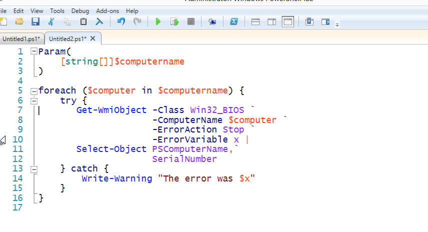
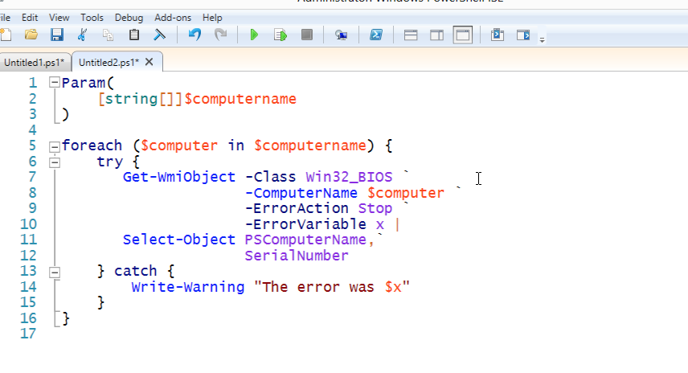
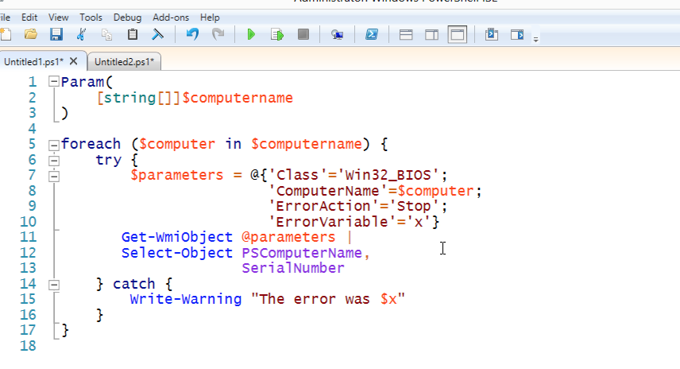

# Backtick, Grave Accent, Escape

You'll see folks do this a lot:

That isn't a dead pixel on your monitor or a stray piece of toner on the page, it's the grave accent mark or backtick. \` is PowerShell's escape character. In this example, it's "escaping" the invisible carriage return at the end of the line, removing its special purpose as a logical line-end, and simply making it a literal carriage return.

I don't like the backtick used this way.

First, it's hard to see. Second, if you get any extra whitespace after it, it'll no longer escape the carriage return, and your script will break. The ISE even figures this out:

Carefully compare the -ComputerName parameter - in this second example, it's the wrong color for a parameter name, because I added a space after the backtick on the preceding line. IMPOSSIBLE to track these down.

And the backtick is unnecessary as a line continuation character. Let me explain why:

PowerShell already allows you to hit Enter in certain situations. You just have to learn what those situations are, and learn to take advantage of them. I totally understand the desire to have neatly-formatted code - I preach about that all the time, myself - but you don't have to rely on a little three-pixel character to get nicely formatted code.

You just have to be clever.

To begin, I've put my Get-WmiObject commands in a hash table, so I can format them all nice and pretty. Each line ends on a semicolon, and PowerShell lets me line-break after each semicolon. Even if I get an extra space or tab after the semicolon, it'll work fine. I then splat those parameters to the Get-WmiObject command.

After Get-WmiObject, I have a pipe character - and you can legally line-break after that, too.

You'll notice on Select-Object that breaking after a comma as well.

So I end up with formatting that looks at least as good, if not better, because it doesn't have that little \` floating all over the place.

