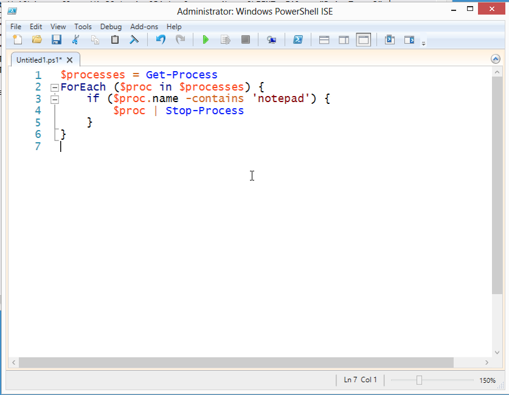
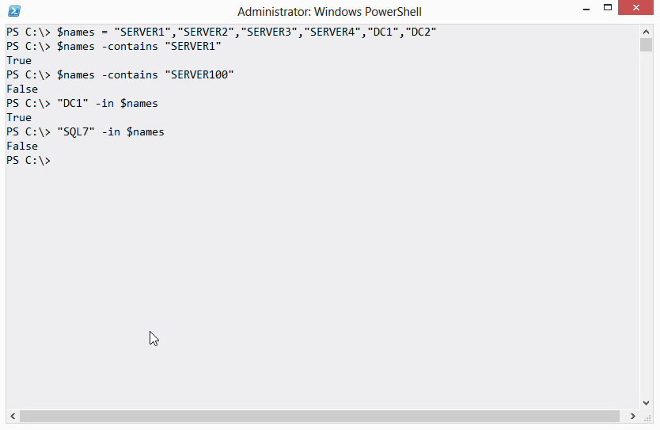
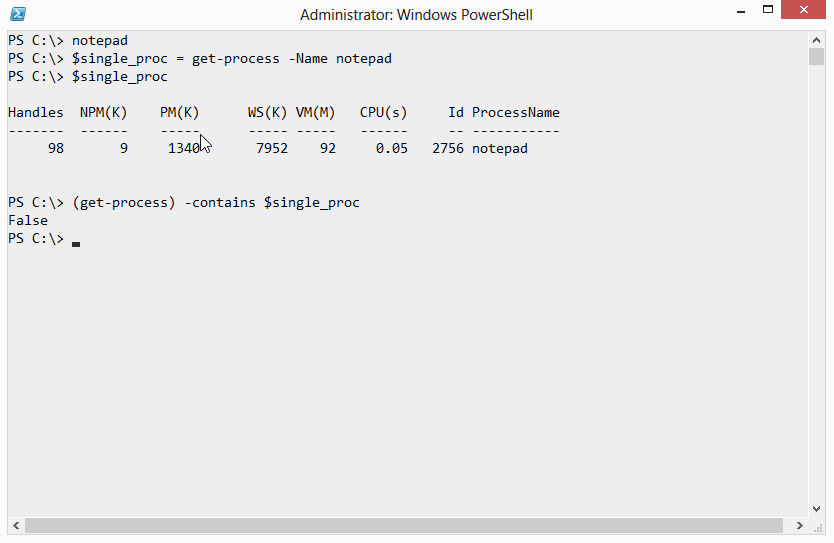

# -Contains isn’t -Like

Oh, if I had a nickel for every time I've seen this:

I get how this happens. The -contains operator seems like it should be checking to see if a process' name contains the letters "notepad." But that isn't what it does.

The correct approach is to use the -like operator, which in fact does do a wildcard string comparison:

I'll let pass the thought that the really correct answer is to just run Stop-Process -name \*notepad\*, because I was aiming for a simple example here. But... don't overthink things. Sometimes a script and a ForEach loop isn't the best approach.

So anyway, what does -contains (and its friend, -notcontains) actually do? They're similar to the -in and -notin operators introduced in PowerShell v3, and those operators cause more than a bit of confusion, too. What they do is check to see if a collection of objects contains a given single object. For example:

In fact, that example is probably the best way to see it work. The trick is that, when you use a complex object instead of a simple value (as I did in that example), -contains and -in look at every property of the object to make a match. If you think about something like a process, they're always changing. From moment to moment, a process' CPU and memory, for example, are different.

In this example, I've started Notepad. I've put its process object into $single\_proc, and you can see that I verified it was there. But when I run Get-Process and check to see if its collection contained my Notepad, I got False. That's because the object in $single\_proc is out of date. Notepad is running, but it now looks different, so -contains can't find the match.

The -in and -contains operators are best with simple values, or with objects that don't have constantly-changing property values. But they're not wild card string matching operators. Use -like (or -notlike) for that.
