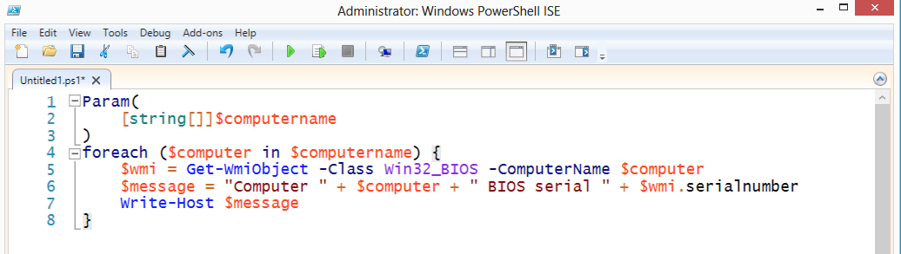
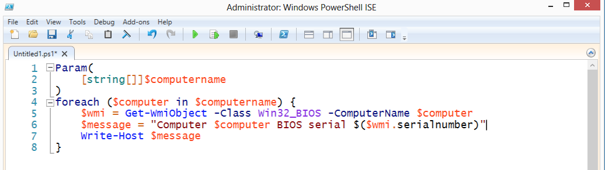
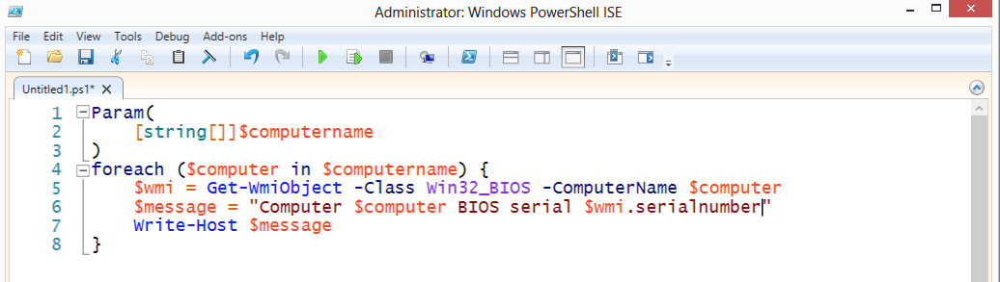

# Don’t+Concatenate+Strings
I really dislike string concatenation. It's like forcing someone to cuddle with someone they don't even know. Rude.

And completely unnecessary, when you use double quotes.

Same end effect. In double quotes, PowerShell will look for the $ character. When it finds it:

1. If the next character is a { then PowerShell will take everything to the matching } as a variable name, and replace the whole thing with that variable's contents. For example, putting ${my variable} inside double quotes will replace that with the contents of ${my variable}.
2. If the next character is a ( then PowerShell will take everything to the matching ) and execute it as code. So, I executed $wmi.serialnumber to access the serialnumber property of whatever object was in the $wmi variable.
3. Otherwise, PowerShell will take every character that is legal for a variable name, up until the first illegal variable name character, and replace it with that variable. That's how $computer works in my example. The space after r isn't legal for a variable name, so PowerShell knows the variable name stops at r.

There's a sub-gotcha here:

This won't work as expected. In most cases, $wmi will be replaced by an object type name, and .serialnumber will still be in there. That's because . isn't a legal variable name character, so PowerShell stops looking at the variable with the letter i. It replaces $wmi with its contents. You see, in the previous example, I'd put $($wmi.serialnumber), which is a subexpression, and which works. The parentheses make their contents execute as code.
