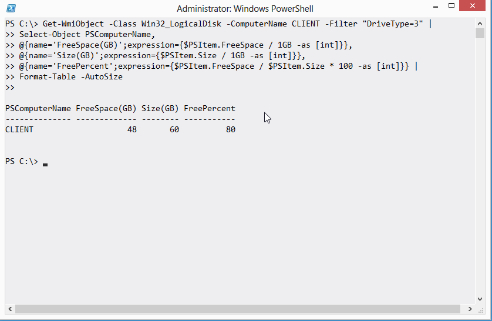
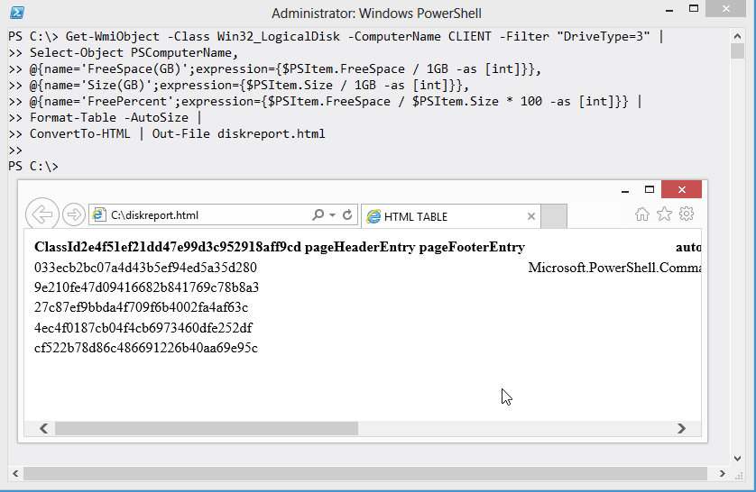

# Format right

Everyone runs into this one. Here's how it goes: you start by writing a truly awesome command.

And you think, "wow, that'd go great in an HTML file."

Wait... what?!?!?

This happens all the time. If you want an easy way to remember what not to do, it's this: Never pipe a Format command to anything else. That isn't the whole truth, and we'll get to the whole truth in a sec, but if you just want a quick answer, that's it. In the community, we call it the "Format Right" rule, because you have to move your Format command to the right-most end of the command line. That is, the Format command comes last, and nothing else comes after it.

The reason is that the Format commands all produce special internal formatting codes, that are really just intended to create an on-screen display. Piping those codes to anything else - ConvertTo-HTML, Export-CSV, whatever - just gets you gibberish output.

In fact, there are actually a few commands that can come after a Format command in the pipeline:

1. Out-Default. This is technically always at the end of the pipeline, although it's invisible. It redirects to Out-Host.
2. Out-Host also understands the output of Format commands, because Out-Host is how those formatting codes get on the screen in the first place.
3. Out-Printer understands the formatting codes too, and constructs a printed page that would look exactly like the normal on-screen output.
4. Out-File, like Out-Printer, redirects the on-screen output, but this time to a text file on disk.
5. Out-String consumes the formatting codes and just outputs a plain string containing the text that would otherwise have appeared on-screen.

Apart from those exceptions - and of them, you'll mainly only ever use Out-File - you can't pipe the output of a Format command to much else and get anything that looks useful.
