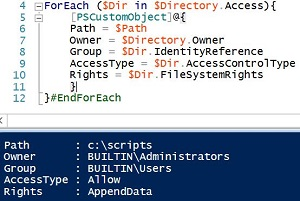

# New-Object PSObject vs. PSCustomObject
There’s often some confusion in regards to the differences between using New-Object PSObject and PSCustomObject, as well as how the two work.

Either approach can be used to take a set of values from a collection of PowerShell objects and collate them into a single output.  As well, both avenues will output the data as NoteProperties in the System.Management.Automation.PSCustomObject object types.  So what’s the big deal between them?

For starters, the New-Object cmdlet was introduced in PowerShell v1.0 and has gone through a number of changes, while the use of the PSCustomObject class came later in v3.0.  For systems using PowerShell v2.0 or earlier, New-Object must be used.  The key difference between the 2.0 version and 1.0 version from an administrative point of view is that 2.0 allows the use of hash tables.  For example:

## New-Object PSObject in v1.0

```
$Path = "c:\scripts"
$Directory = Get-Acl -Path $Path

ForEach ($Dir in $Directory.Access){

    $DirPermissions = New-Object -TypeName PSObject
    $DirPermissions | Add-Member -MemberType NoteProperty -Name Path -Value $Path
    $DirPermissions | Add-Member -MemberType NoteProperty -Name Owner -Value $Directory.Owner
    $DirPermissions | Add-Member -MemberType NoteProperty -Name Group -Value $Dir.IdentityReference
    $DirPermissions | Add-Member -MemberType NoteProperty -Name AccessType -Value $Dir.AccessControlType
    $DirPermissions | Add-Member -MemberType NoteProperty -Name Rights -Value $Dir.FileSystemRights

    $DirPermissions
}
```

With the New-Object method in PowerShell v1.0, you have to declare the object type you want to create and add members to the collection in individual commands.  This changed however in v2.0 with the ability to use hashtables:

## New-Object in PS 2.0

```
$Path = "c:\scripts"
$Directory = Get-Acl -Path $Path

ForEach ($Dir in $Directory.Access){

    $DirPermissions = New-Object -TypeName PSObject -Property @{

    'Path' = $Path
    'Owner' = $Directory.Owner
    'Group' = $Dir.IdentityReference
    'AccessType' = $Dir.AccessControlType
    'Rights' = $Dir.FileSystemRights

    }

    $DirPermissions
}
```

Here's the output:


This saved a lot of overhead in typing and provided a cleaner looking script.  However, both methods have the same problem in that the output is not necessarily in the same order as you have it listed, so if you’re looking for a particular format, it may not work.  PSCustomObject fixed this when it was introduced in v3.0, along with providing more streamlining in your scripts.

## PSCustomObject in PowerShell v3.0
```
$Path = "c:\scripts"
$Directory = Get-Acl -Path $Path

ForEach ($Dir in $Directory.Access){
    [PSCustomObject]@{
    Path = $Path
    Owner = $Directory.Owner
    Group = $Dir.IdentityReference
    AccessType = $Dir.AccessControlType
    Rights = $Dir.FileSystemRights
    }#EndPSCustomObject
}#EndForEach
```



As demonstrated, your output will always match what you have defined in your hashtable.  Another advantage of using PSCustomObject is that it has been noted to enumerate the data faster than its New-Object counterpart.  The only thing to keep in mind with PSCustomObject is that it will not work with systems running PSv2.0 or earlier.


