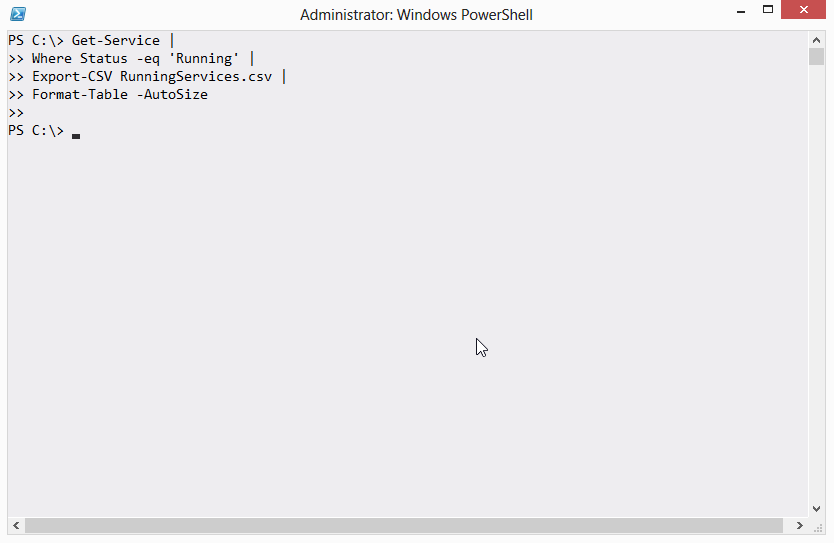
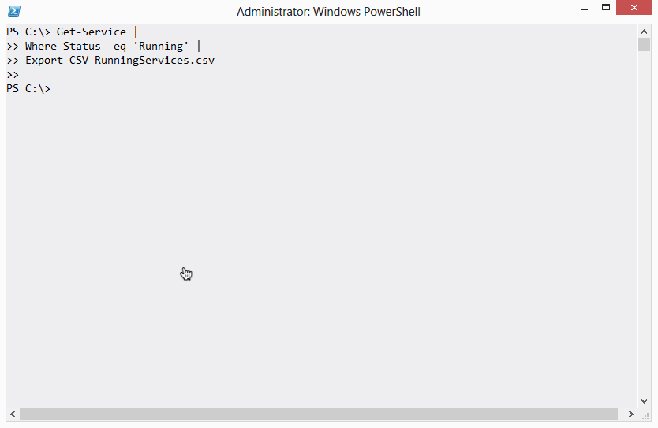

# Not Everything Produces Output
I see this one a lot in classes:

If you expected anything on the screen in terms of output, you'd be disappointed. The trick here is to keep track of what each command produces as output, and right there is a possible point of confusion.

In PowerShell's world, output is what would show up on the screen if you ran the command and didn't pipe it to anything else. Yes, Export-CSV does do something - it creates a file on disk - but in PowerShell's world that file isn't output. What Export-CSV does not do is produce any output - that is, something which would show up on the screen. For example:

See? Nothing. Since there's nothing on the screen, there's nothing in the pipeline. You can't pipe Export-CSV to another command, because there's nothing to pipe.

Some commands will include a -PassThru parameter. When they have one, and when you use it, they'll do whatever they normally do but also pass their input objects through to the pipeline, so that you can then pipe them on to something else. Export-CSV isn't one of those commands, though - it never produces output, so it will never make sense to pipe it to something else.

