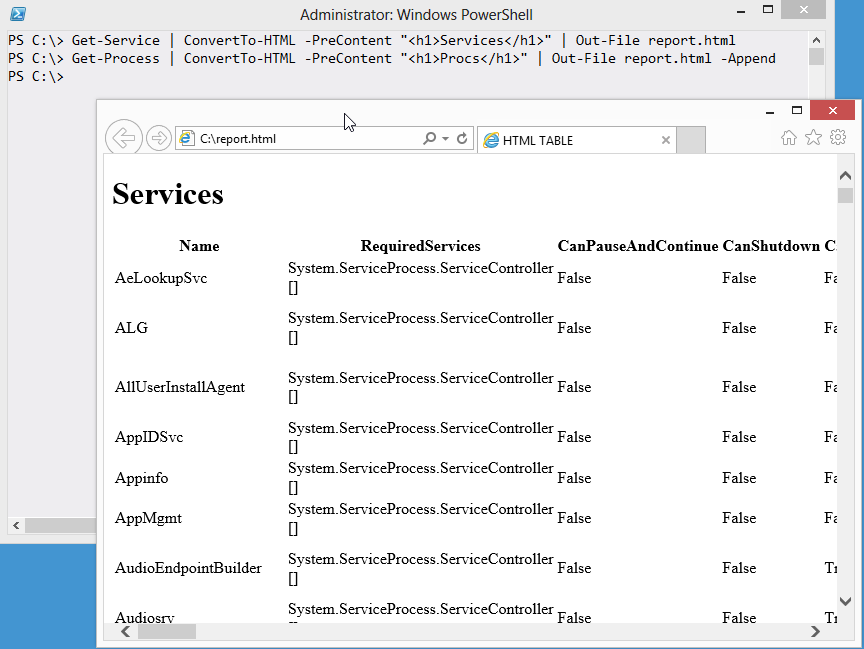
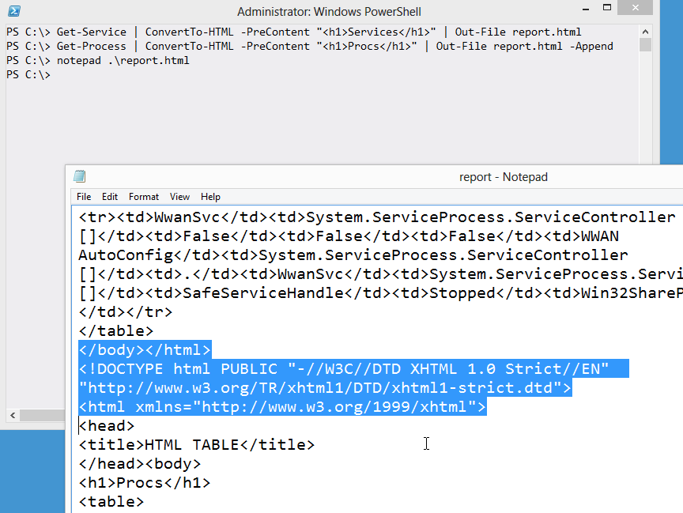

# One HTML Page at a Time, Please
This drives me batty:

What's happening is that someone ran two command, piping the output of each to ConvertTo-HTML, and essentially sticking both HTML pages into a single file. What drives me really nuts is that Internet Explorer is okay with that nonsense.

HTML files are allowed to start with one top-level <HTML> tag, but if you check out that file you'll see that it contains two. Here's the middle bit:

I've highlighted the lines that end one HTML page and start the next one. This is technically a malformed HTML file. It becomes tough to use this with some Web browsers (Firefox 20 is choking it down, but my current Webkit browsers aren't), tough to parse if you ever need to manipulate it programmatically, and... well, it's just a bad thing. It's like incest or something. Gross.

If you need to combine multiple elements into a single HTML file, you use the -Fragment switch of ConvertTo-HTML. That produces just a portion of the HTML, and you can produce several such portions and then combine them into a single, complete page. Ahhh, nice. That whole process is covered in Creating HTML Reports in PowerShell, another free ebook that came with this one
