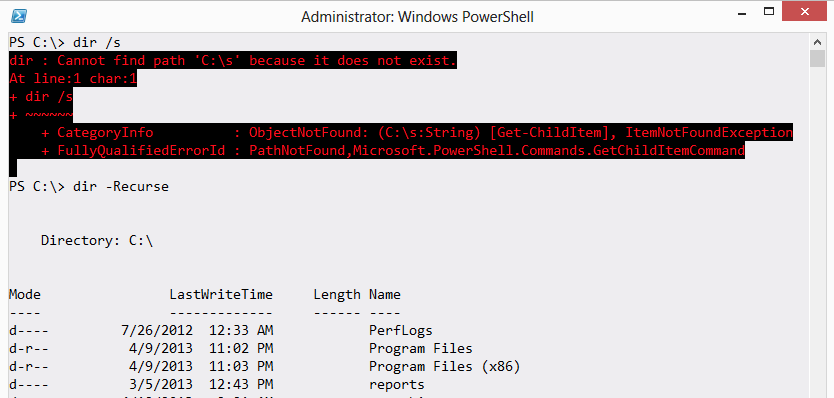

# These aren’t Your Father’s Commands
Always keep in mind that while PowerShell has things called Dir and Cd, they aren't the old MS-DOS commands. They're simply aliases, or nicknames, to PowerShell commands. That means they have different syntax.

You can run help dir (or ask for help on any other alias) to see the actual command name, and its proper syntax.

