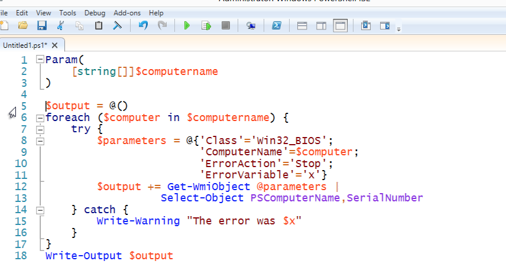
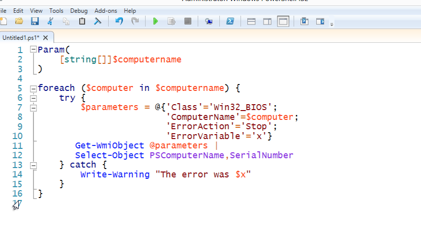

# Use the Pipeline, not an Array
A very common mistake made by traditional programmers who come to PowerShell - which is not a programming language:

This person has created an empty array in $output, and as they run through their computer list and query WMI, they're adding new output objects to the array. Finally, at the end, they output the array to the pipeline.

Poor practice. You see, this forces PowerShell to wait while this entire command completes. Any subsequent commands in the pipeline will sit there twiddling their thumbs. A better approach? Use the pipeline. Its whole purpose is to accumulate output for you - there's no need to accumulate it yourself in an array.

Now, subsequent commands will receive output as its being created, letting several commands run more or less simultaneously in the pipeline.
